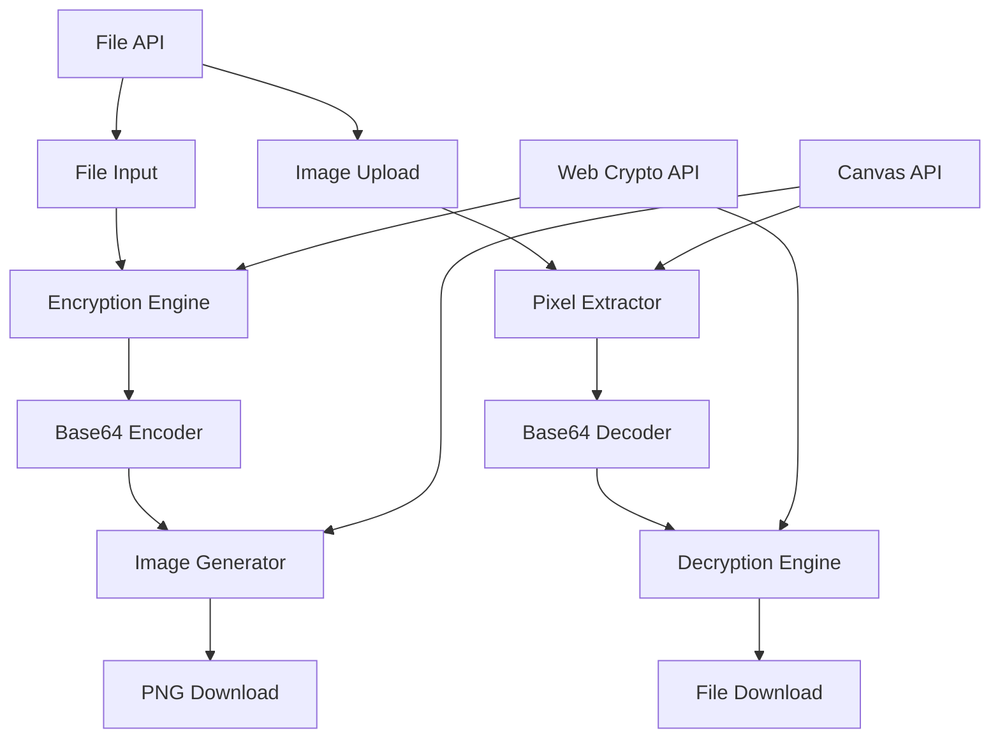

# Design Document

## Overview

The Secure File Image Converter is a client-side web application that encrypts files using AES-GCM encryption and embeds the encrypted data into PNG images for secure transmission. The system operates entirely in the browser using modern Web APIs including the Web Crypto API, File API, and Canvas API.

The application consists of two main workflows:
1. **Encryption Flow**: File → Password Encryption → Base64 Encoding → Image Generation → Download
2. **Decryption Flow**: Image Upload → Pixel Extraction → Base64 Decoding → Password Decryption → File Recovery

## Architecture

### High-Level Architecture



### Component Architecture

The application follows a modular architecture with clear separation of concerns:

- **UI Layer**: Handles user interactions, file uploads, and download triggers
- **Crypto Layer**: Manages encryption/decryption using Web Crypto API
- **Encoding Layer**: Handles Base64 encoding/decoding and image conversion
- **Validation Layer**: Validates inputs and handles error conditions

## Components and Interfaces

### 1. CryptoEngine

**Purpose**: Handles all cryptographic operations using AES-GCM encryption.

**Key Methods**:
```typescript
interface CryptoEngine {
  encrypt(fileData: ArrayBuffer, password: string, metadata: FileMetadata): Promise<EncryptedPayload>
  decrypt(encryptedPayload: EncryptedPayload, password: string): Promise<DecryptedResult>
  deriveKey(password: string, salt: Uint8Array, version: number): Promise<CryptoKey>
}

interface EncryptedPayload {
  magicHeader: Uint8Array  // 6 bytes: "ENCIMG"
  version: number          // 1 byte: format version
  salt: Uint8Array         // 16 bytes
  iv: Uint8Array           // 12 bytes
  encryptedData: Uint8Array
}

interface DecryptedResult {
  fileData: ArrayBuffer
  metadata: FileMetadata
}
```

**Implementation Details**:
- Uses PBKDF2 with 100,000 iterations for key derivation (version 1)
- Generates cryptographically secure random salt and IV
- Magic header: `[0x45, 0x4E, 0x43, 0x49, 0x4D, 0x47]` ("ENCIMG")
- Version byte allows future algorithm upgrades and iteration count changes
- Metadata is prepended to file data before encryption using delimiter format

### 2. ImageConverter

**Purpose**: Converts between Base64 strings and PNG images using Canvas API.

**Key Methods**:
```typescript
interface ImageConverter {
  encodeToImage(base64Data: string): Promise<Blob>
  decodeFromImage(imageFile: File): Promise<string>
  calculateImageDimensions(dataLength: number): { width: number, height: number }
}
```

**Implementation Details**:
- Maps 3 Base64 characters to 1 RGB pixel (3 bytes)
- Uses square dimensions when possible, otherwise fixed width of 1024px
- Handles padding for incomplete pixel data
- Exports as PNG for lossless compression

### 3. FileProcessor

**Purpose**: Orchestrates the complete encryption and decryption workflows.

**Key Methods**:
```typescript
interface FileProcessor {
  encryptFile(file: File, password: string, onProgress: ProgressCallback): Promise<Blob>
  decryptFile(imageFile: File, password: string, onProgress: ProgressCallback): Promise<{ data: ArrayBuffer, filename: string }>
  validateFile(file: File): ValidationResult
}

type ProgressCallback = (percent: number, phase: "Encrypting" | "Base64Encoding" | "Rendering" | "Decoding" | "Decrypting") => void
```

### 4. ValidationEngine

**Purpose**: Validates inputs and provides user-friendly error messages.

**Key Methods**:
```typescript
interface ValidationEngine {
  validateFileSize(file: File): boolean
  validatePassword(password: string): boolean
  validateImageFormat(file: File): boolean
  validateEncryptedPayload(payload: Uint8Array): boolean
}
```

**Validation Rules**:
- Maximum file size: 1GB
- Password: non-empty string
- Image format: PNG only
- Magic header verification for encrypted payloads

## Data Models

### Encrypted Payload Structure

```
[MagicHeader: 6 bytes] [Version: 1 byte] [Salt: 16 bytes] [IV: 12 bytes] [EncryptedData: variable]
```

**Total overhead**: 35 bytes per encrypted file

**Version Support**:
- Version 1: AES-GCM with PBKDF2 (100,000 iterations)
- Future versions may increase iteration count or use different algorithms

### Base64 to Image Mapping

```
Base64 String: "ABC" (3 chars) → [65, 66, 67] (3 bytes) → RGB(65, 66, 67) (1 pixel)
```

**Image Dimensions Calculation**:
```typescript
const pixelCount = Math.ceil(base64Length / 3)
const width = Math.min(1024, Math.ceil(Math.sqrt(pixelCount)))
const height = Math.ceil(pixelCount / width)

// Memory limit check: prevent images exceeding safe browser limits
const MAX_SAFE_DIMENSION = 16384  // 16,384 x 16,384 pixel limit
if (width > MAX_SAFE_DIMENSION || height > MAX_SAFE_DIMENSION) {
  throw new Error("File too large for browser memory limits")
}
```

**Memory Safety**:
- Maximum safe image dimensions: 16,384 × 16,384 pixels
- Estimated memory usage checked before image creation
- Throws error if file would exceed browser heap limits

### File Metadata

Metadata is embedded in the encrypted payload using delimiter format:
```typescript
interface FileMetadata {
  originalFilename: string
  mimeType: string
  timestamp: number
  checksum: string  // SHA-256 hash for integrity verification
}
```

**Metadata Encoding Format**:
```
"filename.ext|application/pdf|timestamp\n\n<actual file bytes>"
```

The metadata is prepended to the file data before encryption, separated by a double newline delimiter.

## Error Handling

### Error Categories

1. **Validation Errors**
   - File too large
   - Invalid password
   - Unsupported file format

2. **Cryptographic Errors**
   - Decryption failure (wrong password)
   - Corrupted encrypted data
   - Invalid magic header

3. **Processing Errors**
   - Memory limitations
   - Canvas rendering failures
   - File system access errors

### Error Response Format

```typescript
interface ErrorResponse {
  code: string
  message: string
  userMessage: string
  recoverable: boolean
}
```

### User-Friendly Error Messages

- `INVALID_PASSWORD`: "The password you entered is incorrect. Please try again."
- `CORRUPTED_IMAGE`: "This image does not contain a valid encrypted file."
- `UNRECOGNIZED_FORMAT`: "The uploaded file is not in a recognized encrypted format."
- `FILE_TOO_LARGE`: "File size exceeds the 1GB limit. Please choose a smaller file."
- `MEMORY_LIMIT`: "File is too large to process in your browser. Try a smaller file."

## Testing Strategy

### Unit Testing

1. **CryptoEngine Tests**
   - Key derivation with known test vectors
   - Encryption/decryption round-trip tests
   - Error handling for invalid inputs

2. **ImageConverter Tests**
   - Base64 to image conversion accuracy
   - Image to Base64 round-trip verification
   - Dimension calculation edge cases

3. **ValidationEngine Tests**
   - File size validation
   - Password strength validation
   - Magic header verification

### Integration Testing

1. **End-to-End Workflow Tests**
   - Complete encrypt → decrypt cycle
   - Various file types and sizes
   - Error scenarios and recovery

2. **Browser Compatibility Tests**
   - Web Crypto API support
   - Canvas API functionality
   - File API operations

### Performance Testing

1. **Memory Usage**
   - Large file processing (up to 1GB)
   - Memory cleanup verification
   - Browser memory limit handling

2. **Processing Speed**
   - Encryption/decryption performance
   - Image generation speed
   - Progress reporting accuracy

### Security Testing

1. **Cryptographic Validation**
   - Key derivation security
   - IV uniqueness verification
   - Encrypted data integrity

2. **Data Leakage Prevention**
   - Memory cleanup after operations
   - No data persistence verification
   - Browser storage isolation

## Security Considerations

### Cryptographic Security

- **AES-GCM**: Provides both confidentiality and authenticity
- **PBKDF2**: Protects against rainbow table attacks
- **Random Salt/IV**: Ensures unique encryption for identical files
- **Key Derivation**: 100,000 iterations balance security and performance

### Browser Security

- **Same-Origin Policy**: All operations confined to the application origin
- **No Network Transmission**: Files and passwords never leave the browser
- **Memory Management**: Sensitive data cleared after use
- **Secure Random**: Uses crypto.getRandomValues() for cryptographic randomness

### Operational Security

- **No Persistence**: No local storage or caching of sensitive data
- **Error Handling**: No sensitive information leaked in error messages
- **Progress Reporting**: No intermediate data exposed during processing
- **Clean Shutdown**: All sensitive variables cleared on completion